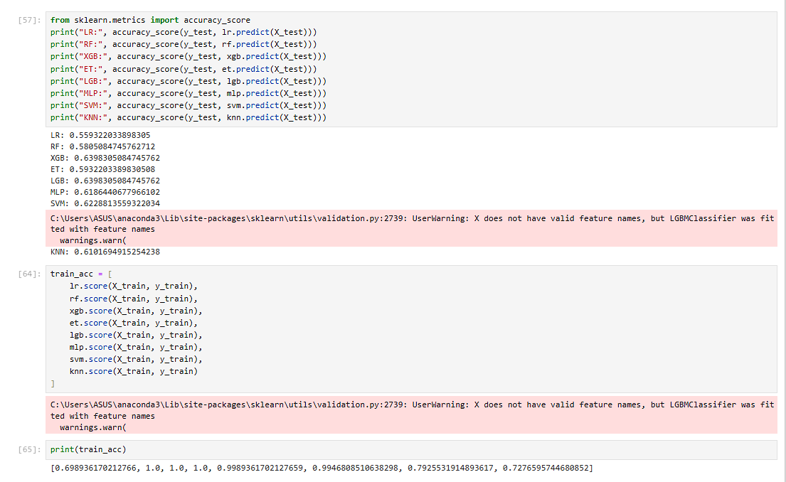

# 🏏 IPL Match Winner Prediction

## Project Overview

This project predicts the winner of an Indian Premier League (IPL) match using Machine Learning techniques and historical IPL match data.

The solution was developed using Python, Jupyter Notebook, and multiple Machine Learning algorithms. The final model was deployed as an interactive web application that allows users to predict match outcomes based on selected match conditions.

---

## Technologies Used

- Python
- Jupyter Notebook
- Pandas
- NumPy
- Scikit-Learn
- XGBoost
- LightGBM
- Random Forest
- SVM
- KNN
- Matplotlib
- Seaborn
- Streamlit

---

## Project Structure

```text
IPL-Match-Winner-Prediction

├── Dataset
├── Notebook
├── Images
├── Model-Files
├── Deployment
├── Reports
└── README.md
```

---

## Dataset

The dataset contains IPL match records from multiple seasons (2008–2025), including:

- Team 1
- Team 2
- Venue
- Toss Winner
- Toss Decision
- Match Winner
- Season Information

### Dataset Preview


---

## Data Cleaning & Preprocessing

The dataset was cleaned and transformed before model training.

Key preprocessing steps:

- Missing value handling
- Team name standardization
- Venue grouping
- Feature encoding
- Feature scaling

### Cleaned Dataset Preview


---

## Feature Engineering

Several domain-specific features were created to improve model performance:

- Team Strength
- Team Form
- Head-to-Head Record
- Venue Advantage
- Toss Advantage
- Form Difference
- Strength Difference

### Top Important Features


---

## Machine Learning Models

The following classification models were trained and evaluated:

- Logistic Regression
- Random Forest Classifier
- XGBoost Classifier
- Extra Trees Classifier
- LightGBM Classifier
- Support Vector Machine (SVM)
- K-Nearest Neighbors (KNN)
- Multi-Layer Perceptron (MLP)

---

## Model Evaluation

Models were evaluated using:

- Accuracy Score
- Cross Validation
- Confusion Matrix
- Feature Importance Analysis

### Model Accuracy Comparison



### Confusion Matrix


### Best Performance

| Model | Accuracy |
|--------|-----------|
| XGBoost | ~64% |
| LightGBM | ~64% |

---

## IPL 2026 Match Predictions

The trained model was used to predict IPL 2026 fixtures.

### Sample IPL 2026 Predictions


### Round-wise Predictions


### Royal Challengers Bengaluru Predictions


---

## Deployment

The final model was deployed as an interactive web application using Streamlit.

Users can provide:

- Team 1
- Team 2
- Venue

The application then predicts the likely winner of the match.

Deployment files are available in the Deployment folder.

---

## Key Visualizations

- Team Win Analysis
- Venue-wise Match Analysis
- Toss Impact Analysis
- Feature Importance
- Model Performance Comparison
- Confusion Matrix
- IPL 2026 Predictions

---

## Future Improvements

- Integration of live IPL data
- Player-level statistics
- Real-time team form updates
- Weather and pitch condition analysis
- Advanced ensemble models

---

## Author

### Harsha Vardhan Raju Karapa

Aspiring Data Analyst | Machine Learning Enthusiast

📧 Email: Add your email

🔗 LinkedIn: Add your LinkedIn profile link

💻 GitHub: Add your GitHub profile link

---

⭐ If you found this project interesting, consider giving it a star.
